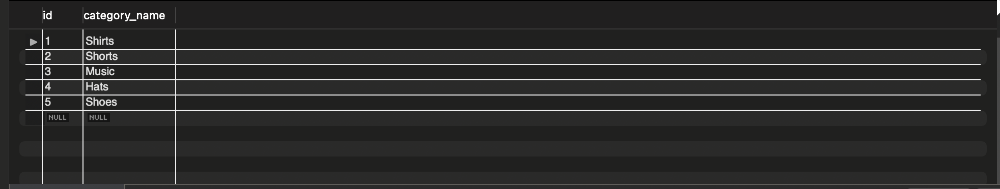
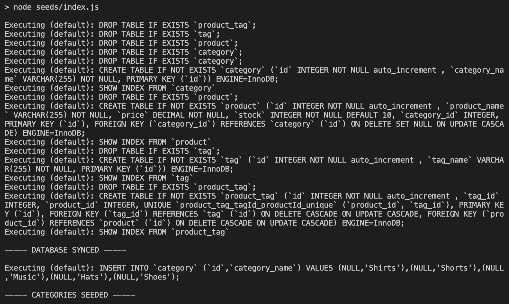
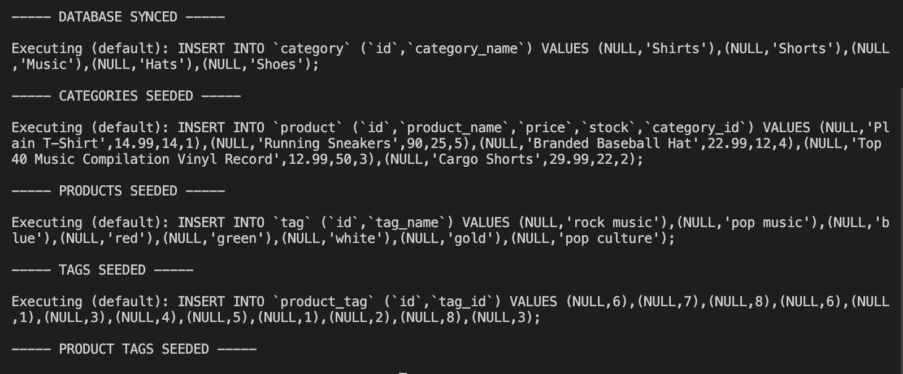

# 13 Object-Relational Mapping (ORM): E-Commerce Back End

## Your Task

Internet retail, also known as **e-commerce**, is the largest sector of the electronics industry, generating an estimated $29 trillion in 2019. E-commerce platforms like Shopify and WooCommerce provide a suite of services to businesses of all sizes. Due to their prevalence, understanding the fundamental architecture of these platforms will benefit you as a full-stack web developer.

Your task is to build the back end for an e-commerce site by modifying starter code. You’ll configure a working Express.js API to use Sequelize to interact with a MySQL database.

Because this application won’t be deployed, you’ll also need to provide a link to a walkthrough video that demonstrates its functionality and all of the acceptance criteria being met. You’ll need to submit a link to the video and add it to the readme of your project.

## User Story

```md
AS A manager at an internet retail company
I WANT a back end for my e-commerce website that uses the latest technologies
SO THAT my company can compete with other e-commerce companies
```
### Database Models

Your database should contain the following four models, including the requirements listed for each model:


## Collaborators

*   [Ian Greenblott Github]()


## Demo Video

*   [Youtube](https://youtu.be/3CphAv_qJME)

## Screenshots

*   
*   
*   

### Associations

You'll need to execute association methods on your Sequelize models to create the following relationships between them:

* `Product` belongs to `Category`, and `Category` has many `Product` models, as a category can have multiple products but a product can only belong to one category.

* `Product` belongs to many `Tag` models, and `Tag` belongs to many `Product` models. Allow products to have multiple tags and tags to have many products by using the `ProductTag` through model.

> **Hint:** Make sure you set up foreign key relationships that match the column we created in the respective models.

### Fill Out the API Routes to Perform RESTful CRUD Operations

Fill out the unfinished routes in `product-routes.js`, `tag-routes.js`, and `category-routes.js` to perform create, read, update, and delete operations using your Sequelize models.

Note that the functionality for creating the many-to-many relationship for products has already been completed for you.

> **Hint**: Be sure to look at the mini-project code for syntax help and use your model's column definitions to figure out what `req.body` will be for POST and PUT routes!

### Seed the Database

After creating the models and routes, run `npm run seed` to seed data to your database so that you can test your routes.

### Sync Sequelize to the Database on Server Start

Create the code needed in `server.js` to sync the Sequelize models to the MySQL database on server start.